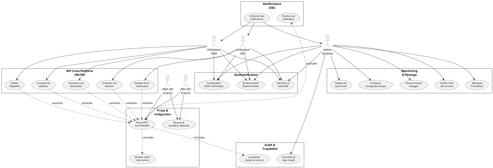
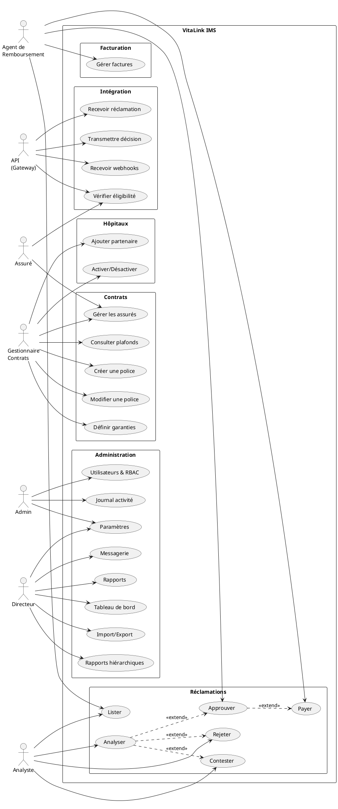

# VitaLink — Diagrammes de cas d'utilisation (PlantUML) & Arborescence

---

## Arborescence du projet

```
vitaLink/
│
├── .agents/
├── .gitignore
│
├── MASTER_PROMPT.md
├── mvp_architecture_sante_complete.md
├── analyse_architecture_plateforme_sante.md
├── implementation_plan.md
├── integration_architecture.md
├── PLAN_DEMO_REMBOURSEMENT.md
│
├── vitalink-gateway/                    # API Gateway (NestJS 11 — port 3000)
│   ├── package.json
│   ├── nest-cli.json
│   ├── tsconfig.json / tsconfig.build.json
│   ├── Dockerfile
│   ├── docker-compose.yml / docker-compose.prod.yml
│   ├── .eslintrc.js / .prettierrc / .env.example
│   ├── README.md
│   ├── infrastructure/
│   │   ├── grafana/provisioning/datasources/datasources.yml
│   │   └── prometheus/prometheus.yml
│   ├── test/jest-e2e.json
│   └── src/
│       ├── main.ts
│       ├── app.module.ts
│       ├── config/
│       │   ├── configuration.ts
│       │   └── tracing.config.ts
│       ├── common/
│       │   ├── decorators/   (current-user, public, roles)
│       │   ├── dto/          (api-response, pagination)
│       │   ├── enums/        (roles, status)
│       │   ├── filters/      (http-exception)
│       │   ├── guards/       (jwt-auth, scopes)
│       │   └── interceptors/ (logging, transform)
│       └── modules/
│           ├── api/          (eligibility, claims, remboursement, hopitaux)
│           ├── auth/         (login, refresh, blacklist)
│           ├── audit/        (audit trail)
│           ├── monitoring/   (health, metrics, tracing)
│           ├── health/       (health checks)
│           ├── notifications/ (SSE real-time)
│           ├── pilotage/     (cross-platform dashboard)
│           ├── proxy/        (HTTP proxy → HMS, IMS, webhooks)
│           └── routing/      (dynamic routing)
│
├── vitalink-hms-api/                    # HMS API (NestJS 11 — port 3001)
│   ├── package.json
│   ├── nest-cli.json / tsconfig.json / tsconfig.build.json
│   ├── .prettierrc / eslint.config.mjs
│   ├── README.md
│   └── src/
│       ├── main.ts
│       ├── app.module.ts
│       ├── config/configuration.ts
│       ├── seeders/seed.ts
│       ├── common/
│       │   ├── decorators/   (current-user, public, roles)
│       │   ├── dto/          (api-response, pagination)
│       │   ├── enums/        (roles)
│       │   ├── filters/      (http-exception)
│       │   ├── guards/       (jwt-auth, roles)
│       │   ├── interceptors/ (transform)
│       │   └── strategies/   (jwt.strategy)
│       └── modules/
│           ├── auth/
│           ├── patients/
│           ├── billing/
│           ├── consultations/
│           ├── prescriptions/
│           ├── triage/
│           ├── laboratory/
│           ├── hospitalization/
│           ├── personnel/
│           ├── tarifs/
│           ├── eligibility/
│           ├── gateway-client/
│           ├── webhooks/
│           ├── messaging/
│           ├── reports/
│           ├── import-export/
│           ├── dashboard/
│           ├── dossiers-medicaux/
│           ├── written-reports/
│           ├── insurance/
│           └── health/
│
├── vitalink-ims-api/                    # IMS API (NestJS 11 — port 3002)
│   ├── package.json
│   ├── nest-cli.json / tsconfig.json / tsconfig.build.json
│   ├── .prettierrc
│   └── src/
│       ├── main.ts
│       ├── app.module.ts
│       ├── config/configuration.ts
│       ├── seeders/seed.ts
│       ├── common/
│       │   ├── decorators/   (current-user, public, roles)
│       │   ├── dto/          (api-response, pagination)
│       │   ├── enums/        (roles)
│       │   ├── filters/      (http-exception)
│       │   ├── guards/       (jwt-auth, roles)
│       │   ├── interceptors/ (transform)
│       │   ├── schemas/      (base.schema)
│       │   ├── strategies/   (jwt.strategy)
│       │   └── utils/        (pagination.helper)
│       └── modules/
│           ├── auth/
│           ├── policies/
│           ├── claims-processing/
│           ├── eligibility-provider/
│           ├── insureds/
│           ├── partner-hospitals/
│           ├── invoices/
│           ├── reports-ims/
│           ├── import-export-ims/
│           ├── messaging-ims/
│           ├── written-reports-ims/
│           ├── gateway-client/
│           ├── webhooks/
│           └── health/
│
├── vitalink-hms/                        # HMS Frontend (React 19 + Vite — port 5173)
│   ├── package.json
│   ├── vite.config.ts / tsconfig.json
│   ├── index.html
│   ├── .env
│   ├── update-imports.cjs
│   └── src/
│       ├── main.tsx
│       ├── App.tsx
│       ├── index.css
│       ├── vite-env.d.ts
│       ├── types/index.ts
│       ├── utils/cn.ts
│       ├── lib/ (faker.ts, format.ts)
│       ├── mocks/ (api-client.ts, seed.ts, store.ts)
│       ├── stores/ (authStore.ts, uiStore.ts)
│       ├── hooks/ (useNotifications.ts, usePermission.ts, useTheme.ts)
│       ├── services/
│       │   ├── http/ (base-http-client.ts, gateway-http-client.ts, index.ts)
│       │   └── (acts, audit, auth, billing, consultations, dashboard,
│       │        import-export, insurance, medical-records, messaging,
│       │        patients, personnel, pharmacy, prescriptions, refunds,
│       │        reports, settings, users, written-reports).service.ts
│       ├── components/
│       │   ├── layout/ (AppShell, Header, MobileNav, PageHeader, Sidebar)
│       │   └── ui/ (Avatar, Badge, Button, Card, DataTable, Feedback,
│       │             ImportCSVModal, Input, Modal, Stat, ThemeToggle)
│       └── pages/
│           ├── Login.tsx
│           ├── Dashboard.tsx
│           ├── Patients.tsx / PatientDetail.tsx
│           ├── Consultations.tsx / Acts.tsx
│           ├── Billing.tsx / Refunds.tsx
│           ├── Insurance.tsx
│           ├── Triage.tsx / Laboratory.tsx
│           ├── Nursing.tsx / Cashier.tsx
│           ├── Personnel.tsx / Tarifs.tsx
│           ├── Ordonnances.tsx / Pharmacie.tsx
│           ├── Reports.tsx / WrittenReports.tsx
│           ├── Messages.tsx / Users.tsx
│           ├── AuditLog.tsx / Settings.tsx
│
└── vitalink-ims/                        # IMS Frontend (React 19 + Vite — port 5174)
    ├── package.json
    ├── vite.config.ts / tsconfig.json
    ├── index.html
    ├── .env
    ├── update-imports.cjs
    └── src/
        ├── main.tsx
        ├── App.tsx
        ├── types/index.ts
        ├── utils/cn.ts
        ├── store/index.ts
        ├── mocks/ (faker.ts, api.ts)
        ├── hooks/useApi.ts
        ├── services/
        │   ├── http/ (base-http-client.ts, gateway-http-client.ts, index.ts)
        │   └── (auth, claims, export, hospitals, insureds, invoices,
        │        policies, reports).service.ts
        ├── components/
        │   ├── layout/ (AppLayout, Topbar, Sidebar)
        │   ├── ui/ (Badge, Button, Card, Input, KpiCard, Modal,
        │            PageHeader, States, Table, Tabs)
        │   └── ProtectedRoute.tsx
        └── pages/
            ├── Login.tsx
            ├── Dashboard.tsx
            ├── Insureds.tsx / Contracts.tsx / Guarantees.tsx
            ├── Hospitals.tsx
            ├── Claims.tsx / Invoices.tsx
            ├── Reports.tsx / Users.tsx
            ├── RBAC.tsx / Activity.tsx
            ├── Messages.tsx / Settings.tsx
```

---

## Diagrammes de cas d'utilisation (PlantUML)

Copiez-collez chaque bloc dans un éditeur PlantUML (plantuml.com, VS Code avec extension PlantUML, etc.) pour visualiser.

### 1. Cas d'utilisation — Gateway (Orchestrateur central)



---

### 2. Cas d'utilisation — HMS (Hôpital)

```plantuml
@startuml hms_usecases
top to bottom direction
skinparam packageStyle rectangle
skinparam usecaseFontSize 11
skinparam defaultTextAlignment center

actor "Réceptionniste" as reception
actor "Médecin" as medecin
actor "Infirmier\nde tri" as tri
actor "Infirmier\nde soins" as nursing
actor "Laborantin" as labo
actor "Comptable" as comptable
actor "Pharmacien" as pharmacien
actor "Directeur" as directeur
actor "Admin\nHMS" as admin

package "Patients" {
  usecase "Enregistrer un\npatient" as H1
  usecase "Rechercher un\npatient (MRN)" as H2
  usecase "Modifier les\ninfos patient" as H3
  usecase "Consulter\nl'historique patient" as H4
  usecase "Gérer antécédents\n& allergies" as H5
}

package "Consultations\n& Prescriptions" {
  usecase "Planifier une\nconsultation" as H6
  usecase "Consulter la\nliste du jour" as H7
  usecase "Prescrire une\nordonnance" as H11
  usecase "Historique des\nprescriptions" as H12
}

package "Urgences &\nSoins" {
  usecase "Triage urgence" as H8
  usecase "Admettre patient\n(hospitalisation)" as H13
  usecase "Gérer les\nsorties" as H14
  usecase "Soins\ninfirmiers" as H15
}

package "Laboratoire" {
  usecase "Prescrire des\nexamens" as H9
  usecase "Saisir des\nrésultats" as H10
}

package "Pharmacie" {
  usecase "Délivrer\nmédicaments" as H16
}

package "Facturation\n& Remboursement" {
  usecase "Gérer la\ncaisse" as H17
  usecase "Créer une facture\n(actes)" as H18
  usecase "Soumettre à\nl'assurance" as H19
  usecase "Vérifier\nl'éligibilité" as H20
  usecase "Suivre les\nremboursements" as H21
  usecase "Gérer les\ncompagnies d'assurance" as H22
}

package "Administration" {
  usecase "Tarifs des\nactes" as H23
  usecase "Gérer le\npersonnel" as H24
  usecase "Gérer les\nutilisateurs" as H25
  usecase "Tableau de\nbord KPI" as H26
  usecase "Rapports" as H27
  usecase "Import/Export\ndes données" as H28
  usecase "Logs d'audit" as H29
  usecase "Rapports\nhiérarchiques" as H30
  usecase "Paramètres" as H32
}

package "Communication" {
  usecase "Messagerie\ninterne" as H31
}

reception --> H1
reception --> H2
reception --> H6
reception --> H13

medecin --> H2
medecin --> H4
medecin --> H5
medecin --> H6
medecin --> H7
medecin --> H9
medecin --> H11
medecin --> H12
medecin --> H31

tri --> H2
tri --> H8
tri --> H13

nursing --> H13
nursing --> H14
nursing --> H15

labo --> H9
labo --> H10

comptable --> H2
comptable --> H17
comptable --> H18
comptable --> H19
comptable --> H20
comptable --> H21
comptable --> H22

pharmacien --> H11
pharmacien --> H12
pharmacien --> H16

directeur --> H23
directeur --> H24
directeur --> H26
directeur --> H27
directeur --> H28
directeur --> H30
directeur --> H32

admin --> H25
admin --> H29
admin --> H32

H20 ..> H19 : <<include>>
H19 ..> H18 : <<extend>>
H19 ..> H21 : <<include>>

@enduml
```



---

### 3. Cas d'utilisation — IMS (Assurance)



---

## Prompt pour générer l'architecture du projet en image (ChatGPT)

Copiez-collez ce prompt dans ChatGPT (GPT-4o ou GPT-4o avec capacité de génération d'images DALL·E ou Diagrams) :

```
Génère un diagramme d'architecture technique (propre, lisible, couleurs professionnelles) pour le projet suivant :

**VitaLink** — ERP Santé Open Source qui connecte hôpitaux et assurances sur une plateforme unique.

## Stack technique
- Backend: NestJS 11 + TypeScript + Mongoose 8 (MongoDB ODM)
- Frontend: React 19 + TypeScript + Vite + Tailwind CSS v4 + Zustand + TanStack Query
- Auth: Passport.js (JWT), RBAC (JwtAuthGuard, RolesGuard, ScopesGuard)
- API Docs: Swagger (@nestjs/swagger)
- Monitoring: OpenTelemetry, Prometheus, Grafana
- Messaging: RabbitMQ (amqplib)
- Containers: Docker

## Architecture

### 1. vitalink-gateway (Port 3000)
Orchestrateur central — seul point d'entrée entre HMS et IMS.
- Auth (JWT login, refresh, blacklist)
- Proxy HTTP vers HMS (:3001) et IMS (:3002) avec tokens inter-service
- API cross-platform: éligibilité, soumission réclamation, décisions, hôpitaux (EN/FR)
- Audit trail (MongoDB, append-only)
- Notifications SSE (temps réel)
- Webhooks (réception et forwarding)
- Pilotage (dashboard croisé)
- Monitoring (health, Prometheus metrics, OpenTelemetry)
- Dynamic routing

### 2. vitalink-hms-api (Port 3001) — Base de données: vitalink_hms_db
Gestion hospitalière (21 modules):
- Auth, Patients (CRUD + MRN), Consultations, Prescriptions, Triage, Laboratory,
  Hospitalization, Personnel, Tarifs, Billing (factures + soumission assurance),
  Eligibility (vérification via Gateway), Dossiers Médicaux (antécédents, allergies),
  Messaging, Reports, Written Reports, Import/Export, Dashboard, Insurance,
  Gateway Client, Webhooks, Health

### 3. vitalink-ims-api (Port 3002) — Base de données: vitalink_ims_db
Gestion assurantielle (15 modules):
- Auth, Policies (CRUD + garanties + plafonds), Claims Processing (recevoir, analyser,
  approuver, rejeter, payer, contester), Eligibility Provider, Insureds,
  Partner Hospitals, Invoices, Reports, Import/Export, Messaging,
  Written Reports, Gateway Client, Webhooks, Health

### 4. vitalink-hms (Port 5173) — Frontend React Hôpital
22 pages: Login, Dashboard, Patients, PatientDetail, Consultations, Acts,
Billing, Refunds, Insurance, Triage, Laboratory, Nursing, Cashier, Personnel,
Tarifs, Ordonnances, Pharmacie, Reports, WrittenReports, Messages, Users,
AuditLog, Settings

### 5. vitalink-ims (Port 5174) — Frontend React Assurance
14 pages: Login, Dashboard, Insureds, Contracts, Guarantees, Hospitals,
Claims, Invoices, Reports, Users, RBAC, Activity, Messages, Settings

## Flux clé — Remboursement
1. HMS Frontend → crée facture → soumet à l'assurance via HMS API
2. HMS API → Gateway (submitClaim) → proxy vers IMS API
3. IMS Frontend → liste les réclamations → agent analyse → approuve/rejette/paye
4. IMS API → Gateway (POST /claims/:id/decision) → webhook vers HMS API
5. HMS API → met à jour le statut facture → HMS Frontend reflète le changement

## Contraintes
- 3 bases MongoDB séparées (gateway_db, hms_db, ims_db)
- HMS et IMS ne communiquent JAMAIS directement — toujours via Gateway
- JWT scopes (scope:hospital vs scope:insurance) pour l'isolation
- Soft delete sur toutes les entités (createdAt, updatedAt, deletedAt)
- Bilingue EN/FR sur les endpoints du Gateway

Le diagramme doit montrer :
- Les 5 sous-systèmes (Gateway, HMS API, IMS API, HMS Frontend, IMS Frontend)
- Les 3 bases de données MongoDB
- Les flux de communication (flèches avec labels)
- Les ports, les technologies clés
- Le flux de remboursement en évidence
- Une légende claire
- Style moderne, couleurs douces (bleu médical, vert assurance, gris gateway)
- Format paysage
```

