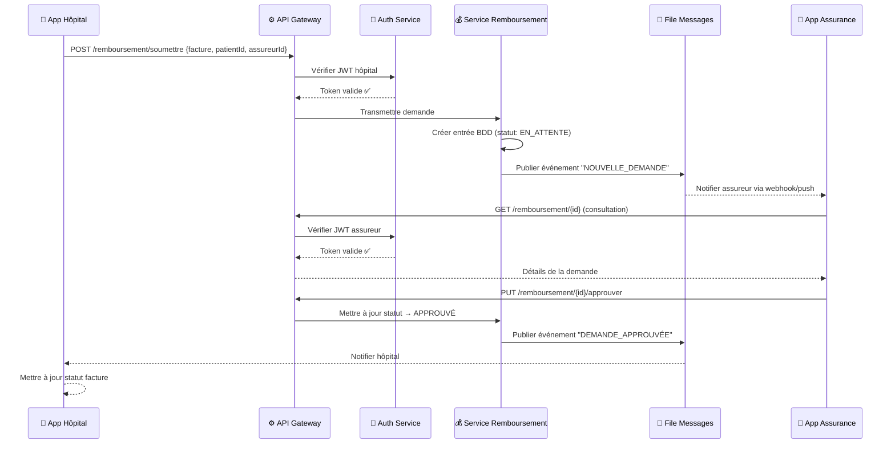
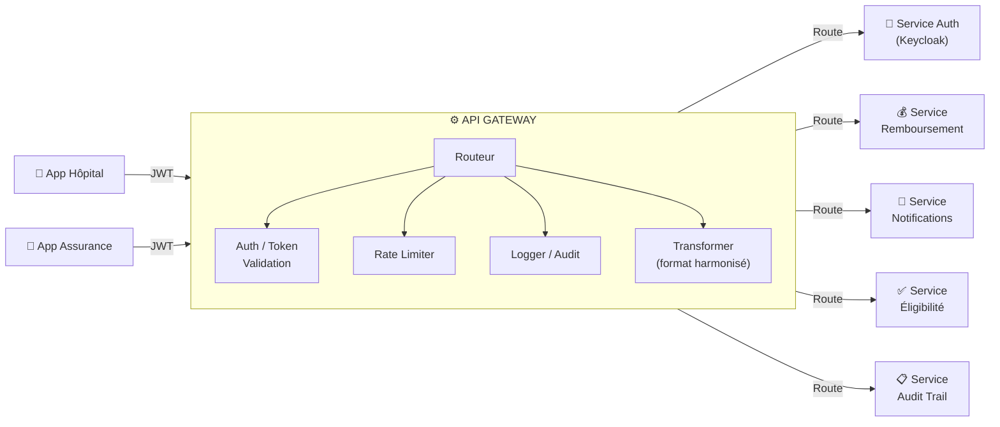
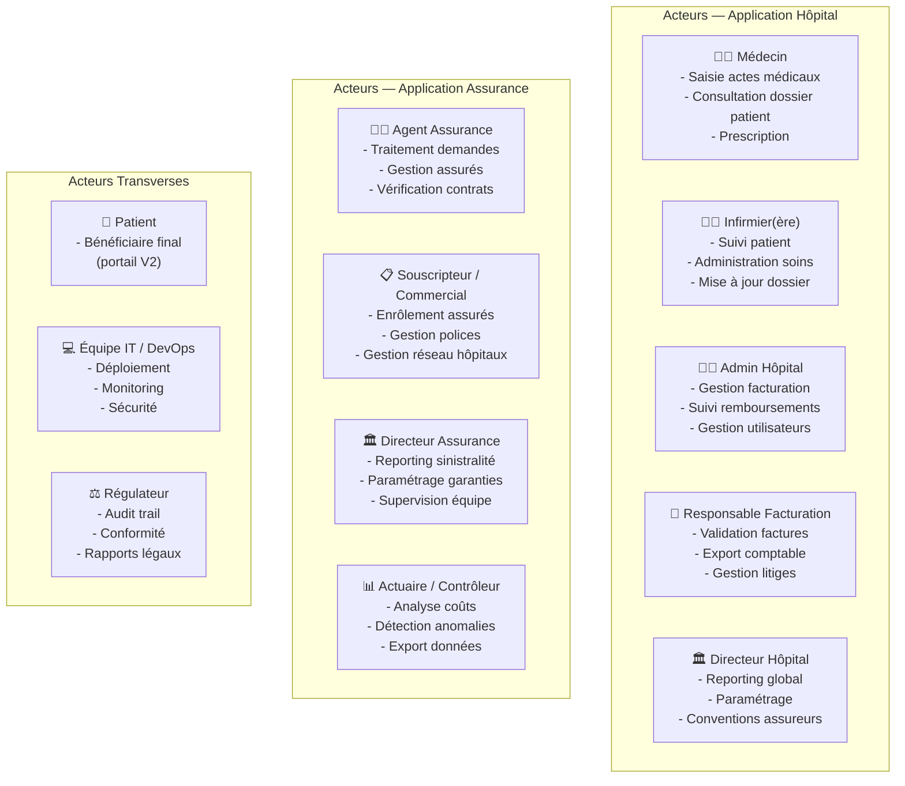
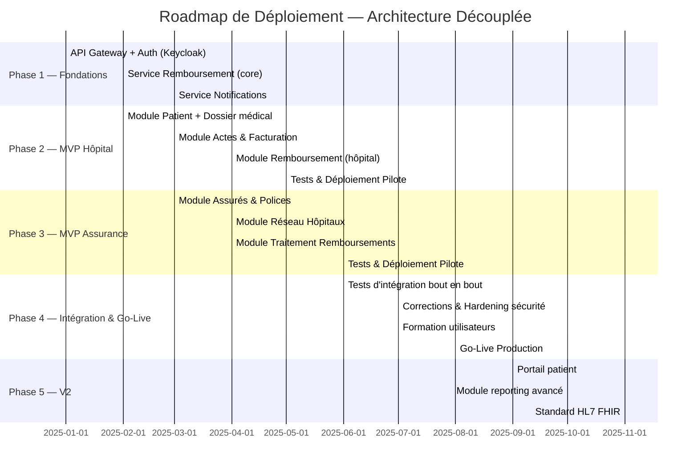

# Architecture Découplée : MVP Hôpital · MVP Assurance · API Gateway

> **Vision** : Deux applications indépendantes, déployées séparément, communicant via une API Gateway centrale — architecture pensée pour la durée, la scalabilité et la conformité sectorielle.

---

## 1. Vue d'Ensemble Stratégique

### Pourquoi deux MVP séparés ?

Le choix de séparer les deux MVP repose sur une réalité métier fondamentale : **un hôpital et un assureur n'ont pas les mêmes contraintes, les mêmes cycles de vie logiciels, ni les mêmes utilisateurs cibles.**

- Un hôpital fonctionne **24h/24, 7j/7** avec des pics d'utilisation imprévisibles (urgences)
- Un assureur travaille principalement en **heures de bureau** avec des volumes prévisibles
- Les mises à jour réglementaires touchent souvent **un seul des deux secteurs** à la fois
- Les équipes techniques de chaque côté peuvent évoluer **indépendamment**

Cette séparation permet de construire deux produits qui excellent dans leur domaine respectif, liés par un contrat d'API clair et stable.

---

## 2. Architecture Globale — Diagramme Mermaid

```mermaid
graph TB
    subgraph HOPITAL["🏥 APPLICATION HÔPITAL"]
        direction TB
        HUI["Interface Web / Tablette\n(React.js)"]
        HAPI["API Hôpital\n(NestJS / FastAPI)"]
        HDB[("Base de données\nHôpital\nPostgreSQL")]
        HCACHE["Cache Redis\n(Sessions / Files)"]
        HUI --> HAPI
        HAPI --> HDB
        HAPI --> HCACHE
    end

    subgraph ASSURANCE["🏢 APPLICATION ASSURANCE"]
        direction TB
        AUI["Interface Web Desktop\n(React.js)"]
        AAPI["API Assurance\n(NestJS / FastAPI)"]
        ADB[("Base de données\nAssurance\nPostgreSQL")]
        ACACHE["Cache Redis\n(Sessions / Reports)"]
        AUI --> AAPI
        AAPI --> ADB
        AAPI --> ACACHE
    end

    subgraph GATEWAY["⚙️ API GATEWAY CENTRALE"]
        direction TB
        GW["API Gateway\n(Kong / AWS API GW)"]
        AUTH["Service Auth\n(Keycloak / OAuth2)"]
        REMBRS["Service\nRemboursement"]
        NOTIF["Service\nNotifications"]
        AUDIT["Service\nAudit & Logs"]
        QUEUE["File de messages\n(RabbitMQ / Kafka)"]
        GDB[("Base Partagée\nRemboursements\nPostgreSQL)"]
        GW --> AUTH
        GW --> REMBRS
        GW --> NOTIF
        GW --> AUDIT
        REMBRS --> QUEUE
        REMBRS --> GDB
        QUEUE --> NOTIF
        AUDIT --> GDB
    end

    HAPI <-->|"HTTPS / JWT"| GW
    AAPI <-->|"HTTPS / JWT"| GW

    subgraph ACTEURS["👥 Acteurs"]
        MEDECIN["👨‍⚕️ Médecin"]
        INFIRMIER["👩‍⚕️ Infirmier"]
        ADMIN_H["🧑‍💼 Admin Hôpital"]
        AGENT_A["🧑‍💼 Agent Assurance"]
        SOUSCRIPT["📋 Souscripteur"]
        PATIENT["🧑 Patient"]
    end

    MEDECIN --> HUI
    INFIRMIER --> HUI
    ADMIN_H --> HUI
    AGENT_A --> AUI
    SOUSCRIPT --> AUI
    PATIENT -.->|"Portail patient (futur)"| HUI
```

---

## 3. Flux de Communication Inter-Systèmes



---

## 4. MVP Hôpital — Analyse Complète

### 4.1 Objectif du MVP Hôpital

Permettre à un hôpital de **gérer ses patients, ses soins et sa facturation** tout en soumettant des demandes de remboursement aux assureurs partenaires, avec une traçabilité complète.

### 4.2 Fonctionnalités MVP Hôpital (V1)

#### 🔵 Module Patient
| Fonctionnalité | Priorité | Description |
|---|---|---|
| Admission d'un patient | P0 — Critique | Créer un dossier patient (identité, contacts, assurance) |
| Vérification d'éligibilité assurance | P0 — Critique | Interroger la Gateway pour confirmer la couverture avant soin |
| Gestion du dossier médical | P0 — Critique | Saisie des antécédents, allergies, diagnostics |
| Historique des consultations | P1 — Important | Visualiser tous les séjours et actes d'un patient |
| Recherche & filtres patients | P1 — Important | Recherche par nom, ID, numéro de police |

#### 🟢 Module Soins & Actes
| Fonctionnalité | Priorité | Description |
|---|---|---|
| Saisie des actes médicaux | P0 — Critique | Actes codifiés (CIM-10, codes locaux) par médecin |
| Prescription médicaments | P1 — Important | Liste des médicaments administrés durant le séjour |
| Gestion des examens | P1 — Important | Labo, imagerie, résultats liés au dossier |
| Suivi de séjour (lits) | P2 — Utile | Gestion de l'occupation par service |

#### 🟡 Module Facturation
| Fonctionnalité | Priorité | Description |
|---|---|---|
| Génération automatique de facture | P0 — Critique | À partir des actes saisis, calcul automatique du montant |
| Calcul part patient / part assurance | P0 — Critique | Selon les garanties du contrat récupérées via Gateway |
| Envoi facture à l'assureur | P0 — Critique | Soumission de la demande de remboursement via Gateway |
| Suivi statut remboursement | P0 — Critique | Tableau de bord : EN_ATTENTE / APPROUVÉ / REJETÉ / LITIGE |
| Export PDF de la facture | P1 — Important | Pour archivage et remise au patient |
| Relances automatiques | P2 — Utile | Alerte si aucun retour de l'assureur sous N jours |

#### 🔴 Module Administration Hôpital
| Fonctionnalité | Priorité | Description |
|---|---|---|
| Gestion des utilisateurs | P0 — Critique | Créer comptes médecins, infirmiers, administratifs |
| Gestion des rôles & permissions | P0 — Critique | Qui peut voir / modifier quoi |
| Paramétrage des services | P1 — Important | Urgences, Cardiologie, Pédiatrie, etc. |
| Journal d'audit local | P1 — Important | Qui a fait quoi et quand dans le système |

### 4.3 Ce qui est hors MVP (V2+)
- Portail patient self-service
- Téléconsultation
- Intégration équipements médicaux (IoT)
- Module RH complet
- Pharmacie interne

### 4.4 Stack technique MVP Hôpital

```
Frontend    : React.js + Tailwind CSS (responsive, tablette-friendly)
Backend     : NestJS (Node.js) ou FastAPI (Python)
Base de données : PostgreSQL (schéma hôpital isolé)
Cache       : Redis (sessions, rate limiting)
Auth        : JWT via Keycloak (Gateway centrale)
Déploiement : Docker + 1 VPS cloud (OVH, AWS EC2 ou Azure VM)
CI/CD       : GitHub Actions
```

---

## 5. MVP Assurance — Analyse Complète

### 5.1 Objectif du MVP Assurance

Permettre à un assureur de **gérer son portefeuille de patients, son réseau d'hôpitaux agréés, ses contrats et le traitement des demandes de remboursement** qui lui parviennent.

### 5.2 Fonctionnalités MVP Assurance (V1)

#### 🔵 Module Portefeuille Assuré
| Fonctionnalité | Priorité | Description |
|---|---|---|
| Enrôlement d'un assuré | P0 — Critique | Créer un profil assuré, associer à une police |
| Gestion des polices d'assurance | P0 — Critique | Création, modification, suspension, résiliation |
| Définition des garanties | P0 — Critique | Ce qui est couvert, les plafonds, les exclusions |
| Vérification d'éligibilité (répondre) | P0 — Critique | Répondre aux requêtes d'éligibilité des hôpitaux |
| Historique des assurés | P1 — Important | Toutes les consultations et remboursements liés |

#### 🟢 Module Réseau Hôpitaux
| Fonctionnalité | Priorité | Description |
|---|---|---|
| Ajout d'un hôpital partenaire | P0 — Critique | Référencer un hôpital dans le réseau agréé |
| Gestion des conventions | P1 — Important | Tarifs négociés par acte avec chaque hôpital |
| Activation / Désactivation hôpital | P1 — Important | Suspendre un hôpital du réseau sans le supprimer |
| Annuaire des hôpitaux | P2 — Utile | Vue cartographique du réseau partenaire |

#### 🟡 Module Remboursements
| Fonctionnalité | Priorité | Description |
|---|---|---|
| Réception des demandes | P0 — Critique | Tableau de bord des demandes entrantes |
| Consultation du détail facture | P0 — Critique | Voir tous les actes, montants, pièces jointes |
| Approuver une demande | P0 — Critique | Valider et déclencher le paiement |
| Rejeter avec motif | P0 — Critique | Refus documenté et notifié à l'hôpital |
| Mettre en litige | P1 — Important | Déclencher un workflow de contestation |
| Historique des traitements | P1 — Important | Toutes les décisions prises par l'équipe |
| Export comptable | P1 — Important | Export CSV / Excel pour comptabilité interne |

#### 🔴 Module Reporting & Administration
| Fonctionnalité | Priorité | Description |
|---|---|---|
| Tableau de bord KPI | P0 — Critique | Taux de sinistralité, coût moyen par acte, délais |
| Gestion des utilisateurs | P0 — Critique | Agents, superviseurs, directeurs |
| Paramétrage des règles métier | P1 — Important | Seuils d'approbation automatique, alertes |
| Alertes & Notifications | P1 — Important | Demandes en attente depuis X jours |

### 5.3 Ce qui est hors MVP (V2+)
- Simulation de cotisation en ligne
- Portail self-service assuré
- Module actuariat
- Intégration bancaire directe (virement automatique)
- Détection de fraude par IA

### 5.4 Stack technique MVP Assurance

```
Frontend    : React.js + Tailwind CSS (desktop-first, dashboards riches)
Backend     : NestJS (Node.js) ou FastAPI (Python)
Base de données : PostgreSQL (schéma assurance isolé)
Cache       : Redis (sessions, cache reporting)
Auth        : JWT via Keycloak (Gateway centrale)
Déploiement : Docker + 1 VPS cloud (séparé de l'hôpital)
CI/CD       : GitHub Actions
```

---

## 6. API Gateway Centrale — Architecture Détaillée

### 6.1 Rôle de la Gateway

La Gateway est le **seul point de contact** entre les deux applications. Elle ne stocke pas de logique métier complexe — elle **orchestre, sécurise et route**.



### 6.2 Endpoints principaux de la Gateway

| Endpoint | Méthode | Appelant | Description |
|---|---|---|---|
| `/auth/token` | POST | Les deux | Obtenir un JWT |
| `/auth/refresh` | POST | Les deux | Rafraîchir le token |
| `/eligibilite/{patientId}/{assureurId}` | GET | Hôpital | Vérifier la couverture avant soin |
| `/remboursement/soumettre` | POST | Hôpital | Soumettre une demande de remboursement |
| `/remboursement/{id}` | GET | Les deux | Consulter le détail d'une demande |
| `/remboursement/{id}/approuver` | PUT | Assurance | Approuver une demande |
| `/remboursement/{id}/rejeter` | PUT | Assurance | Rejeter avec motif |
| `/remboursement/{id}/litige` | PUT | Les deux | Déclencher un litige |
| `/notifications/subscribe` | POST | Les deux | S'abonner aux événements (webhooks) |
| `/audit/{entiteId}` | GET | Les deux | Consulter l'historique d'audit |
| `/hopitaux/{id}/statut` | GET | Assurance | Vérifier qu'un hôpital est bien agréé |

### 6.3 Sécurité de la Gateway

- **TLS 1.3 obligatoire** sur tous les appels inter-services
- **JWT à courte durée de vie** (15 min) + Refresh Token (7 jours)
- **Scopes différenciés** : `scope:hopital` vs `scope:assureur` — un hôpital ne peut jamais appeler un endpoint assureur et vice versa
- **Rate Limiting** : 1000 requêtes/minute par application, 100 requêtes/minute par IP
- **IP Whitelisting** en production : seuls les serveurs des deux applications peuvent appeler la Gateway

---

## 7. Avantages de cette Architecture à Long Terme

### 7.1 Avantages techniques

| Avantage | Impact |
|---|---|
| **Déploiements indépendants** | Mettre à jour l'app hôpital sans toucher à l'app assurance |
| **Scalabilité ciblée** | En cas de forte charge côté hôpital (épidémie), scaler uniquement cette application |
| **Isolation des pannes** | Un bug critique côté assurance n'affecte pas les soins hospitaliers |
| **Technologie adaptée** | L'app hôpital peut être optimisée pour mobile/tablette, l'app assurance pour desktop |
| **Évolution des équipes** | Deux équipes distinctes peuvent avancer en parallèle sans blocage |
| **Tests indépendants** | Chaque MVP a sa propre suite de tests, son propre cycle de release |

### 7.2 Avantages métier

| Avantage | Impact |
|---|---|
| **SLA différenciés** | L'app hôpital peut avoir un SLA 99,99% (critique), l'assurance 99,9% |
| **Commercialisation séparée** | Vendre l'app hôpital seule à des hôpitaux sans assureur partenaire |
| **Conformité réglementaire facilitée** | Audits ciblés par secteur (santé vs assurance) |
| **Personnalisation par client** | Un hôpital peut avoir une version customisée sans impacter les assureurs |
| **Roadmaps indépendantes** | Les assureurs peuvent demander des fonctionnalités qui n'impactent pas les hôpitaux |

---

## 8. Benchmark — Qui a déjà fait ça ?

### 8.1 Plateformes existantes similaires

| Plateforme | Pays | Architecture | Ce qu'on peut en apprendre |
|---|---|---|---|
| **Availity** (USA) | États-Unis | API Gateway centrale entre hôpitaux et assureurs | Leader mondial de l'interopérabilité assurance-hôpital. Prouve la viabilité du modèle à grande échelle. |
| **Alma** | France | App hôpital + interface praticien + module assurance complémentaire | A commencé par un seul MVP praticien, puis étendu. Valorisation : 1,4 Mrd € en 2022. |
| **Leecare / Meditech** | Australie / USA | HIS (Hospital Information System) découplé avec connecteurs assureurs | Architecture API-first adoptée dès 2015, aujourd'hui standard du secteur. |
| **Odoo Health** | Belgique / International | Modules séparés (clinique, facturation, assurance) sur une API commune | Montre qu'une architecture modulaire peut être déployée pays par pays |
| **mTiba** (Kenya) | Afrique de l'Est | Wallet santé mobile connecté aux assureurs et hôpitaux | Contexte africain proche. A prouvé que le modèle fonctionne avec une forte contrainte mobile. |
| **Carepay** (Kenya / Nigeria) | Afrique | Plateforme B2B2C reliant assureurs, employeurs et hôpitaux | Modèle de business très proche. A levé plusieurs millions USD. Présent au Kenya, Nigeria, Ghana. |

### 8.2 Leçons tirées du benchmark

- **La Gateway centrale est universelle** : tous les acteurs matures ont adopté ce pattern. C'est aujourd'hui le standard de l'industrie.
- **Le module de remboursement est toujours le différenciateur clé** : c'est là que se joue la valeur ajoutée de la plateforme.
- **Le contexte africain exige une priorité mobile** : mTiba et Carepay ont fait du mobile-first leur pilier — fonctionnement offline partiel, interfaces légères, SMS comme canal de notification secondaire.
- **Commencer B2B** (hôpitaux + assureurs) avant d'ouvrir aux patients a été la stratégie gagnante dans tous les cas.
- **Les standards d'interopérabilité (HL7 FHIR)** sont de plus en plus imposés réglementairement — les prévoir dès la V2 est un avantage compétitif.

---

## 9. Acteurs Principaux du Système



### 9.1 Matrice des droits par acteur

| Acteur | Voir dossier patient | Saisir actes | Émettre facture | Approuver remboursement | Gérer utilisateurs | Voir reporting |
|---|---|---|---|---|---|---|
| Médecin | ✅ (ses patients) | ✅ | ❌ | ❌ | ❌ | ❌ |
| Infirmier | ✅ (limité) | ✅ (limité) | ❌ | ❌ | ❌ | ❌ |
| Admin Hôpital | ✅ | ❌ | ✅ | ❌ | ✅ (hôpital) | ✅ (hôpital) |
| Agent Assurance | ❌ | ❌ | ❌ | ✅ | ❌ | ✅ (limité) |
| Directeur Assurance | ❌ | ❌ | ❌ | ✅ | ✅ (assurance) | ✅ (global) |
| Actuaire | ❌ | ❌ | ❌ | ❌ | ❌ | ✅ (export) |

---

## 10. Roadmap de Déploiement



---

## 11. Synthèse et Recommandation Finale

### Pourquoi cette architecture est la bonne pour un projet long terme

| Critère | Architecture choisie | Bénéfice |
|---|---|---|
| **Durabilité** | 2 MVP séparés + Gateway | Chaque brique peut évoluer sans tout refaire |
| **Résilience** | Déploiements indépendants | Une panne n'affecte pas l'autre système |
| **Commercialisation** | Produits séparables | Vente possible de chaque MVP indépendamment |
| **Conformité** | Cloisonnement strict des données | Audits sectoriels facilités |
| **Scalabilité** | Scaling ciblé par application | Coûts d'infrastructure optimisés |
| **Équipe** | Développement parallèle | Time-to-market réduit sur chaque MVP |
| **Standard industrie** | Pattern validé par Availity, Carepay, mTiba | Pas de prise de risque architecturale |

### Le message clé

> **Construire séparément, connecter intelligemment.** Les deux MVP partagent une vision commune, un contrat d'API stable et une base de données de remboursements commune — mais chacun peut vivre, évoluer et être vendu indépendamment. C'est la combinaison qui crée la valeur, pas la fusion.

---

*Document produit le 13 juin 2026 — Architecture Système Santé · Confidentiel*
